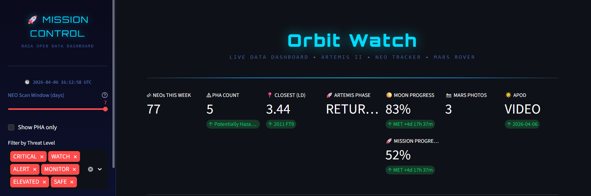

# Orbit Watch V1.0

<div align="center">

# 🚀 Mission Control Dashboard v1.0

**A real-time space data dashboard powered by NASA's Open APIs**




</div>

---

## ✨ Features

| Module | Description | Data Source |
|--------|-------------|-------------|
| ☄ **NEO Tracker** | Live asteroid threat assessment with 6-tier classification | NASA NeoWs API |
| 🚀 **Artemis II** | Real-time mission phase, MET timer & trajectory map | Calculated from confirmed launch data |
| 🔴 **Mars Rover** | Live Perseverance photo gallery | NASA Image Library |
| 🌟 **APOD** | Astronomy Picture of the Day with full explanation | NASA APOD API |
| 📊 **Analytics** | Threat distribution, size histograms, statistical summary | Derived from live API data |


---

## 🛠 Tech Stack

- **Frontend:** Streamlit + custom dark space CSS (Orbitron font)
- **Charts:** Plotly interactive visualizations
- **Data:** Pandas DataFrames
- **Images:** Pillow (PIL) with color enhancement
- **APIs:** NASA NeoWs · NASA APOD · NASA Image Library · JPL CNEOS

---

## 🚀 Quick Start

### 1. Clone the repo
```bash
git clone https://github.com/YOUR_USERNAME/nasa-mission-control.git
cd nasa-mission-control
```

### 2. Install dependencies
```bash
pip install -r requirements.txt
```

### 3. Set up your NASA API key
```bash
# Copy the example env file
cp .env.example .env

# Edit .env and add your key
# Get a free key at: https://api.nasa.gov/
NASA_API_KEY=your_key_here
```

### 4. Run the dashboard
```bash
streamlit run nasa_dashboard.py
```

Open your browser at `http://localhost:8501` 🎉

---

## 📡 NASA APIs Used

| API | Endpoint | Cache TTL |
|-----|----------|-----------|
| NeoWs (Near Earth Objects) | `api.nasa.gov/neo/rest/v1/feed` | 30 min |
| APOD | `api.nasa.gov/planetary/apod` | 60 min |
| NASA Image Library | `images-api.nasa.gov/search` | 60 min |

> Get your free API key at [api.nasa.gov](https://api.nasa.gov/) — 1,000 requests/hour

---

## 🎯 NEO Threat Classification

Author-defined thresholds based on miss distance:

| Level | Miss Distance | Color |
|-------|--------------|-------|
| 🔴 CRITICAL | < 1,000,000 km | Red |
| 🟠 WATCH | < 5,000,000 km | Dark Red |
| 🟡 ALERT | < 10,000,000 km | Orange |
| 🟡 MONITOR | < 20,000,000 km | Dark Orange |
| 🟢 ELEVATED | < 40,000,000 km | Yellow |
| 🟢 SAFE | ≥ 40,000,000 km | Green |

> ⚠️ These thresholds are author-defined and are NOT official NASA/ESA planetary defense categories.

---

## 🚀 Artemis II Mission Data

| Field | Value | Source |
|-------|-------|--------|
| Launch | April 1, 2026 — 22:35:12 UTC | NASA confirmed |
| Crew | Wiseman · Glover · Koch · Hansen | NASA confirmed |
| Vehicle | Orion / SLS Block 1 | NASA confirmed |
| Splashdown | April 10, 2026 — ~00:06 UTC | NASA confirmed |
| Duration | ~217.5 hours | Calculated |

---

## 📁 Project Structure

```
nasa-mission-control/
├── nasa_dashboard.py    # Main Streamlit application
├── requirements.txt     # Python dependencies
├── .env.example         # API key template
├── .gitignore           # Excludes secrets + cache
├── LICENSE              # MIT + NASA CC0 attribution
├── README.md            # This file
└── assets/
    └── preview.png      # Dashboard screenshot
```

---

## ⚖️ License & Attribution

- Code: © 2026 araCreate Group
- Data: **NASA Open Data CC0** — [api.nasa.gov](https://api.nasa.gov/)
- APOD images may carry individual photographer copyrights (displayed in-app)
- **Not affiliated with or endorsed by NASA**

---

<div align="center">
Built with 🚀 by araCreate Group &nbsp;|&nbsp; 
Data from <a href="https://api.nasa.gov">NASA Open APIs</a>
</div>
